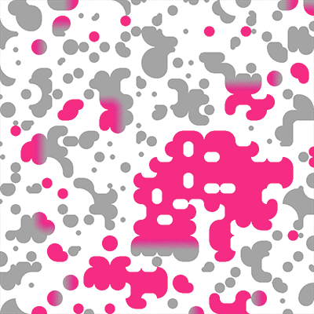

# Wave-Function-Collapse

This is my contribution to the coding challenge from The Coding Train.
I am not sure how to fork an existing project.
This is why I downloaded the code, worked on it, and set up a new repo. :-|
This is JavaScript with p5.js.

- [Wave Function Collapse video and challenge](https://thecodingtrain.com/challenges/171-wave-function-collapse)
- [Wave Function Collapse source by CodingTrain](https://github.com/CodingTrain/Wave-Function-Collapse)

## My changes

- I created my own tile system to create a rather simple abstract ornamental pattern.
- I optimized by checking the entropy only for cells that are neighbours of already collapsed cells. Raised the performance a lot.
- When stuck because there is no fitting tile for a cell instead of starting all over I reset the collapsed neighbours of this cell and try again to complete the grid.

## Future plans

- Other designs
- Movie clips / frame animations instead of images
- Generative content instead of images for filling the cells (e.g. animated curves or shapes)
- 3d grid
- hexagonal grid
